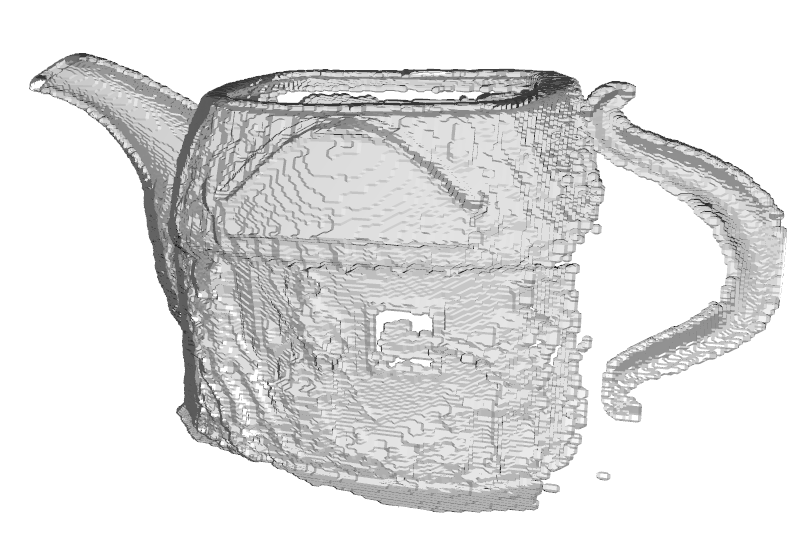

# MeshFusionX: Объединение .x-мешей и генерация 3D-модели

📌 **Краткое описание**  
Данный проект предназначен для объединения 3D-моделей, сохранённых в формате `.x` (DirectX), с последующим построением объединённой модели на основе воксельного представления.  
Результатом работы является финальный меш, полученный методом марширующих кубиков.

_Автор: Меркурьев М. А._\
_Дальневосточный федеральный университет, 2025_
---

## 🛠 Основной функционал

- ✅ Парсинг .x-файлов: вершины, треугольники, uv-координаты, матрицы трансформации
- ✅ Применение матриц трансформации к вершинам
- ✅ Объединение нескольких мешей в единый PointCloud с расчётом нормалей
- ✅ Оптимизация поз и регистрация с использованием Open3D
- ✅ Построение воксельной модели (размером 512³)
- ✅ Генерация финального меша методом марширующих кубиков
- ✅ Сохранение результата в формате `.x`

---

## 🔍 Примеры визуализации

| Совмещённые точки исходных мешей       | Объединённые точки              | Меш после марширующих кубиков |
|----------------------------------------|---------------------------------|-------------------------------|
|  |  |  |

---

## 🚀 Быстрый старт

1. Установите зависимости:
   ```bash
   pip install -r requirements.txt
   ```
   или 
   ```bash
   conda install --file requirements.txt
   ```
   или

2. Поместите исходные .x-файлы в папку `data/`

3. Запустите jupiter-блокнот `run.ipynb`:

4. Готовый меш будет сохранён в файл `output_mesh.x`

## 📸 Авторы и вдохновение
Разработка велась в рамках лабораторной работы по дисциплине "Обработка и визуализация больших объемов графических данных" с использованием воксельных методов.