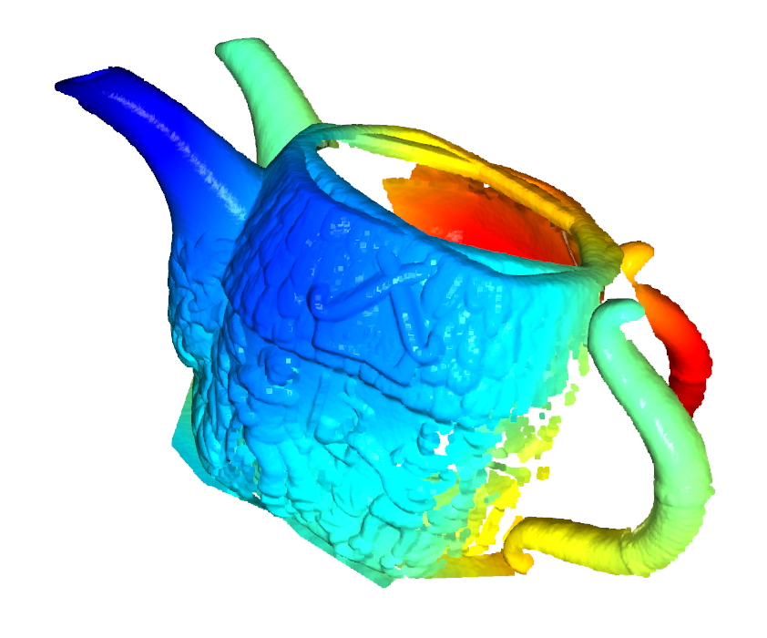
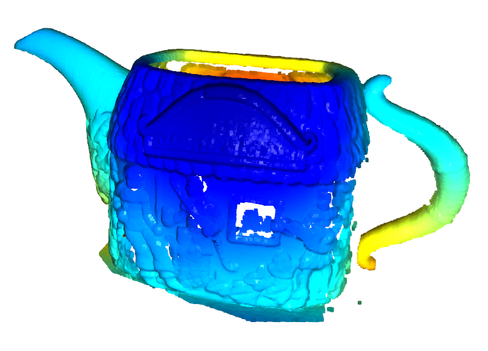
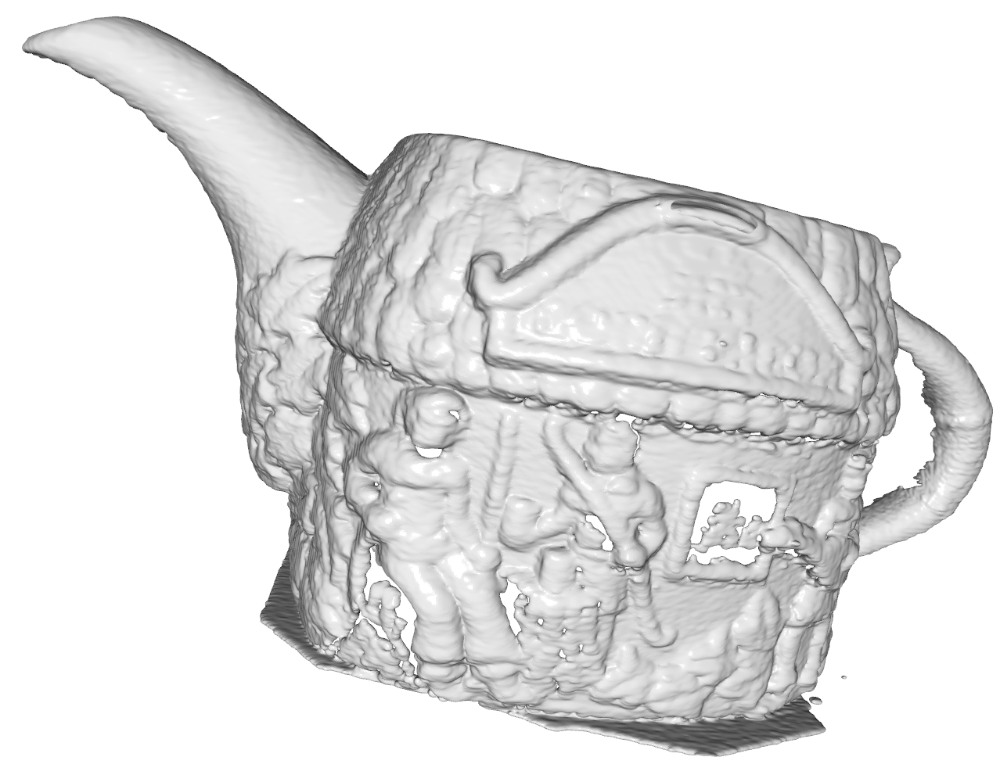

# 🧊 Voxel Fusion 3D Reconstruction
## Merging `.x` models and generating a smooth 3D surface


### 👤 Maxim Merkurev
🏫 _Far Eastern Federal University, 2025_

## 📌 About the project
This project implements a **modified voxel-based method** for merging 3D models saved in the `.x` format, followed by the reconstruction of a unified surface using an **integrated scalar field of distances and weights**.

The method enables the generation of a **smooth mesh** from multiple viewpoints, incorporating voxelization, alignment by normals and depth, and final reconstruction using the **Marching Cubes** algorithm.

---

## 🛠 Core Functionality

- ✅ Parsing `.x` models: vertices, triangles, UV coordinates, transformations
- ✅ Aligning all meshes into a shared world coordinate system (`frame_matrix`)
- ✅ Building a `256³` 3D scalar field based on distance and weight functions
- ✅ Merging multiple fields based on surface normals and depth alignment
- ✅ Surface reconstruction using the **Marching Cubes** algorithm
- ✅ Exporting the final mesh in `.x` format

---

## 🚀 Quick Start

1. Clone the repository:
```bash
git clone https://github.com/Bit-Maximum/Voxel-Fusion-3D-Reconstruction.git
cd Voxel-Fusion-3D-Reconstruction
```

2. Install dependencies:
```bash
pip install -r requirements.txt
```

3. Place your `.x` files into the `data/` folder (or use the provided examples)

4. Launch the Jupyter notebook:
```bash
jupyter lab run.ipynb
```

The final mesh will be saved as `output_mesh.x` in the project root

---

## 🔍 Visualization Examples

| Input PointClouds                                 | Merged PointCloud                      | Final Mesh (after Marching Cubes) |
|---------------------------------------------------|-----------------------------------------|------------------------------------------|
|  |  |      |

---

## 🔧 Technologies Used

- Python 3.10+
- NumPy
- Open3D
- SKImage
- Open3D
- Matplotlib
- Jupyter Notebook
- Собственный парсер `.x`-формата

---

## 📖 Scientific Background

This project is inspired by the method proposed in the following study:
> Bobkov, V.A., Kudryashov, A.P.
A modification of the voxel method for constructing a unified triangulated surface of an object from multiple views.
// Tomsk State University Journal of Mathematics and Mechanics, 2012.

> _Бобков, В.А., Кудряшов, А.П.
Модификация воксельного метода для построения единой триангуляционной оболочки объекта по множеству видов.
// Вестник Томского государственного университета. Математика и механика, 2012._

---

## 🧪 Academic Context
This project was completed as the final assignment for the course:
📘 **«Processing and Visualization of Large Volumes of Graphic Data»**
The main focus was the practical implementation of voxel-based fusion and surface generation.

## 📝 Possible Improvements
* Texture support for the final model
* Export to `.obj`, `.ply`, or `.glb` formats
* Interactive result viewer using Open3D
